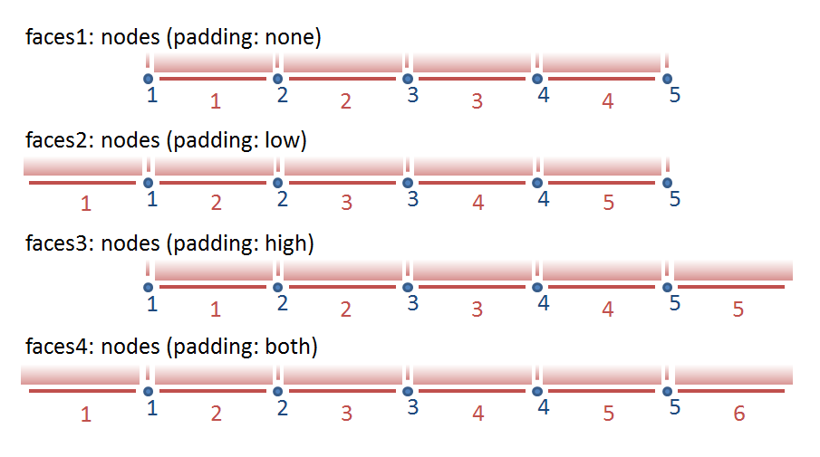

# SGRID Conventions (v0.3)

Following the success of the [UGRID conventions](https://github.com/ugrid-conventions/ugrid-conventions),
Bert Jagers created conventions for staggered data on structured grids that are consistent with the UGRID conventions.
We refer to these as the SGRID conventions, described below.

## Introduction

The [CF-conventions](http://cfconventions.org/) are widely used for storing and distributing environmental / earth sciences / climate data. The CF-conventions use a data perspective: every data value points to the latitude and longitude at which that value has been defined; the combination of latitude and longitude bounds and cell methods attributes can be used to define spatially averaged rather than point values. 

This is all great for the distribution of (interpolated) data for general visualization and spatial data processing,
but it doesn't capture the relationship of the variables as computed by a numerical model (such as [Arakawa staggering](http://en.wikipedia.org/wiki/Arakawa_grids)). Many models use staggered grids (using finite differences, or finite volume approach) or use a finite element approach of which the correct meaning may not be captured easily by simple cell methods descriptors.
This becomes a problem if you don't want to just look at the big picture of the model results,
but also at the details at the grid resolution:
* What is the exact meaning of a flux on the output file in discrete terms?
* Can we verify the mass balance?
* Can the data be used for restarting the model?

Correctly handling the staggered data has always been a crucial element of model post-processing tools. In the UGRID conventions, we have defined the (unstructured) grid as a separate entity on the file which consists of nodes and connections of nodes defining edges, faces, and volumes.
For a structured (staggered) grid we are currently lacking a consistent convention. Although one could store structured grid data using UGRID conventions,
some fundamental aspects such as distinction between grid directions would be lost.

In this context we have created these lightweight SGRID conventions to define the core aspects of a structured staggered grid without trying to capture the details of finite element formulations.
This is an attempt to bring conventions for structured grids on par with those for unstructured grids.

## Conventions

Consistent with the UGRID conventions we use the following terms for points,
lines, and cells that make up a grid.


|Dimensionality |Name   |Comments                                                                                                                 |
|---------------|-------|-------------------------------------------------------------------------------------------------------------------------|
|0              |node   |A point, a coordinate pair or triplet: the most basic element of the topology (also known as "vertex").                  |
|1              |edge   |A line or curve bounded by two nodes.                                                                                    |
|2              |face   |A plane or surface enclosed by a set of edges. In a Cartesian 2D model, you might refer to this as a "cell" or "square". |
|3              |volume |A volume enclosed by a set of faces.                                                                                     |

In the UGRID conventions the focus is on describing the topology of the mesh (connectivity of the nodes, edges, faces, and volumes as appropriate).
The topology of a structured grid is inherently defined;
the focus for the SGRID conventions is therefore on the numbering used.
Still we need to distinguish between 2D and 3D grids (1D conventions may be defined consistently).

### 2D grid

|Required topology attributes |Value                                                                                               |
|-----------------------------|----------------------------------------------------------------------------------------------------|
|cf_role                      |grid_topology                                                                                       |
|topology_dimension           | 2                                                                                                  |
|node_dimensions              |node_dimension1 node_dimension2                                                                     |
|face_dimensions              |face_dimension1:node_dimension1 (padding:*type1*) face_dimension2:node_dimension2 (padding:*type2*) |

|Optional attributes          |Default value                                                                                       |
|-----------------------------|----------------------------------------------------------------------------------------------------|
|edge1_dimensions             |node_dimension1 face_dimension2:node_dimension2 (padding:*type2*)                                   |
|edge2_dimensions             |face_dimension1:node_dimension1 (padding:*type1*) node_dimension2                                   |
|node_coordinates             |                                                                                                    |
|edge1_coordinates            |         
|edge2_coordinates            |                                                                                                    |
|face_coordinate              |                                                                                                    |
|vertical_dimensions          |                                                                                                    |
                                                                                           |

where the padding type may be one of the four literal strings:
"none", "low", "high", or "both" depending on whether the face_dimension is one shorter than the corresponding node_dimension (padding:none),
one longer than the corresponding node_dimension (padding:both),
or of equal length with one extra value stored on the low or high end of the dimension (see the figure below).
The edge1_dimensions and edge2_dimensions attributes may be used to define separate dimensions for the edges (see the ROMS example below),
but by default the edge dimensions are assumed to be consistent with the dimensions used by the edges and faces respectively.
The optional vertical_dimensions attribute may be used to specify the names of the dimensions for the layers and layer interfaces respectively using the same syntax:
layer_dimension:layer_interface_dimension (padding:*type*).

Note:

- The numbering of the edges corresponds to the order of the dimensions in the dimensions attributes.
  The order of the dimensions listed here does not change since these are specified as a string.
  The actual order of dimensions in the netCDF API (and hence in the dump generated by different tools) depends on the programming language used.
  Hence, the order of the dimensions listed here may differ from the order of the dimensions in the data definition.


Figure 1: illustrating the formulations used for expressing the relationship between face/edge and node dimensions. Please note that the numbering of the faces and nodes can be adjusted using face(face) and node(node) coordinate variables.

Example:

```java
dimensions:
    time = UNLIMITED ;
    inode = 10 ;
    jnode = 20 ;
    icell = 9 ;
    jcell = 19 ;

variables:
    char time(time) ;
        time:standard_name = "time" ;
        time:long_name = "time" ;
        time:units = "seconds since 2015-01-01 00:00:00" ;
    float u(time, jcell, inode) ;
        u:description = "x-velocity" ;
        u:units = "m s-1" ;
        u:grid = "MyGrid" ;
        u:location = "edge1" ;
    float v(time, jnode, icell) ;
        u:description = "y-velocity" ;
        u:units = "m s-1" ;
        u:grid = "MyGrid" ;
        u:location = "edge2" ;
    float c(time, jcell, icell) ;
        c:description = "some concentration" ;
        c:grid = "MyGrid" ;
        c:location = "face" ;
    float node_lat(jnode, inode) ;
        node_lat:standard_name = "latitude" ;
        node_lat:units = "degree_north" ;
    float node_lon(jnode, inode) ;
        node_lon:standard_name = "longitude" ;
        node_lon:units = "degree_east" ;

    int MyGrid ;
        grid:cf_role = grid_topology
        grid:topology_dimension = 2 ;
        grid:node_dimensions = "inode jnode" ;
        grid:face_dimensions = "icell: inode (padding: none) jcell: jnode (padding: none)" ;
        grid:node_coordinates = "node_lon node_lat" ;
```

### 3D grid

|Required topology attributes |Value                                                                                                                                                 |
|-----------------------------|------------------------------------------------------------------------------------------------------------------------------------------------------|
|cf_role                      |grid_topology                                                                                       |
|topology_dimension           | 3                                                                                                    |node_dimensions              |node_dimension1 node_dimension2 node_dimension3  
|volume_dimensions            |face_dimension1:node_dimension1 (padding:*type1*) face_dimension2:node_dimension2 (padding:*type2*) face_dimension3:node_dimension3 (padding:*type3*) |

|Optional attributes          |Default value                                                                                                                                         |
|-----------------------------|------------------------------------------------------------------------------------------------------------------------------------------------------|
|edge1_dimensions             |face_dimension1:node_dimension1 (padding:*type1*) node_dimension2 node_dimension3                                                                     |
|edge2_dimensions             |node_dimension1 face_dimension2:node_dimension2 (padding:*type2*) node_dimension3                                                                     |
|edge3_dimensions             |node_dimension1 node_dimension2 face_dimension3:node_dimension3 (padding:*type3*)                                                                     |
|face1_dimensions             |node_dimension1 face_dimension2:node_dimension2 (padding:*type2*) face_dimension3:node_dimension3 (padding:*type3*)                                   |
|face2_dimensions             |face_dimension1:node_dimension1 (padding:*type1*) node_dimension2 face_dimension3:node_dimension3 (padding:*type3*)                                   |
|face3_dimensions             |face_dimension1:node_dimension1 (padding:*type1*) face_dimension2:node_dimension2 (padding:*type2*) node_dimension3                                   |
|node_coordinates             |                                                                                                                                                      |
|edge *i*_coordinates          |                                                                                                                                                      |
|face *i*_coordinates          |                                                                                                                                                      |
|volume_coordinates           |                                                                                                                                                      |

Notes:

- The edge1, edge2, and edge3 are in a 3D grid aligned to the dimensions1, 2, and 3 respectively,
  whereas the edge1 and edge2 are in a 2D grid perpendicular to the dimensions 1 and 2 respectively.
  The face1, face2, and face3 play that role in the 3D grid.
- The 3d grid option should not be used be used for layered grids,
  such as typical ocean and atmosphere models.
  Use the 2d grid with vertical dimensions instead.
  This allows 2D quantities (such as surface quantities) and 3D quantities to be linked to the same mesh.

Example:

```java
dimensions:
    time = UNLIMITED ;
    inode = 10 ;
    jnode = 20 ;
    knode = 30 ;
    iface = 9 ;
    jface = 19 ;
    kface = 29 ;

variables:
    char time(time) ;
        time:standard_name = "time" ;
        time:long_name = "time" ;
        time:units = "seconds since 2015-01-01 00:00:00" ;
    float u(time, kface, jface, inode) ;
        u:description = "x-velocity" ;
        u:units = "m s-1" ;
        u:grid = "MyGrid3" ;
        u:location = "face1" ;
    float v(time, kface, jnode, iface) ;
        u:description = "y-velocity" ;
        u:units = "m s-1" ;
        u:grid = "MyGrid3" ;
        u:location = "face2" ;
    float w(time, knode, jface, iface) ;
        u:description = "z-velocity" ;
        u:units = "m s-1" ;
        u:grid = "MyGrid3" ;
        u:location = "face3" ;
    float c(time, kface, jface, iface) ;
        c:description = "some concentration" ;
        c:grid = "MyGrid3" ;
        c:location = "volume" ;
    float node_lat(knode, jnode, inode) ;
        node_lat:standard_name = "latitude" ;
        node_lat:units = "degree_north" ;
    float node_lon(knode, jnode, inode) ;
        node_lon:standard_name = "longitude" ;
        node_lon:units = "degree_east" ;
    float node_elevation(knode, jnode, inode) ;
        node_elevation:description = "elevation" ;
        node_elevation:units = "m" ;

    int MyGrid3 ;
        grid:cf_role = grid_topology
        grid:topology_dimension = 3 ;
        grid:node_dimensions = "inode jnode knode" ;
        grid:volume_dimensions = "iface: inode (padding: none) jface: jnode (padding: none) kface: knode (padding: none)" ;
        grid:node_coordinates = "node_lon node_lat node_elevation" ;
```

## Data variables

The use of the attributes to associate a data variable with a specific grid and stagger location is copied from the UGRID conventions:
To map the variable onto the topology of the underlying grid,
two new attributes have been introduced.
First, the attribute `grid` points to the grid_topology variable containing the meta-data attributes of the grid on which the variable has been defined.
Second, the attribute `location` points to the (stagger) location within the grid at which the variable is defined.

Example:

```java
double waterlevel(time,j,i) ;
        waterlevel:standard_name = "sea_surface_height_above_geoid" ;
        waterlevel:units = "m" ;
        waterlevel:grid = "MyGrid"
        waterlevel:location = "face" ;
        waterlevel:coordinates = "lat_face_MyGrid lon_face_MyGrid" ;
```

## Examples

### Delft3D

Delft3D uses an Arikawa C-grid with the water level (pressure) computed in the cell centres,
and the normal velocities at the cell edges.
This example shows the use of asymmetric padding (at the low end of the horizontal coordinate indices there is an extra line of face/mid-point values).
In the vertical there is no padding, so the number of layer interfaces is one more than the number of layers.
The integer coodinate variables KMAX and KMAX1 are used to indicate that layer interfaces are numbered 0 to KMAX whereas all other indices use the default numbering from 1 to the maximum value.

```java
netcdf trim-f34 {
dimensions:
    NMAX = 22 ;
    NMAXZ = 22 ;
    MMAX = 15 ;
    MMAXZ = 15 ;
    KMAX = 5 ;
    KMAX1 = 6 ;
    time = UNLIMITED ; // (6 currently)
variables:
    int KMAX(KMAX) ;
    int KMAX1(KMAX1) ;
    float XCOR(MMAX, NMAX) ;
        XCOR:standard_name = "projection_x_coordinate" ;
        XCOR:long_name = "X-coordinate of grid points" ;
        XCOR:units = "m" ;
    float YCOR(MMAX, NMAX) ;
        YCOR:standard_name = "projection_y_coordinate" ;
        YCOR:long_name = "Y-coordinate of grid points" ;
        YCOR:units = "m" ;
    float XZ(MMAXZ, NMAXZ) ;
        XZ:standard_name = "projection_x_coordinate" ;
        XZ:long_name = "X-coordinate of cell centres" ;
        XZ:units = "m" ;
    float YZ(MMAXZ, NMAXZ) ;
        YZ:standard_name = "projection_y_coordinate" ;
        YZ:long_name = "Y-coordinate of cell centres" ;
        YZ:units = "m" ;
    float THICK(KMAX) ;
        THICK:long_name = "Fraction part of layer thickness of total water-height" ;
        THICK:units = "[ .01*% ]" ;
    float time(time) ;
        time:standard_name = "time" ;
        time:long_name = "time" ;
        time:units = "seconds since 1990-08-05 00:00:00" ;
    float S1(time, MMAXZ, NMAXZ) ;
        S1:long_name = "Water-level in zeta point" ;
        S1:units = "m" ;
        S1:coordinates = "XZ YZ" ;
        S1:grid = "grid" ; // SGRID attribute
        S1:location = "face" ; // SGRID attribute
    float U1(time, KMAX, MMAX, NMAXZ) ;
        U1:long_name = "U-velocity per layer in U-point (Eulerian)" ;
        U1:units = "m/s" ;
        U1:grid = "grid" ; // SGRID attribute
        U1:location = "edge1" ; // SGRID attribute
    float V1(time, KMAX, MMAXZ, NMAX) ;
        V1:long_name = "V-velocity per layer in V-point (Eulerian)" ;
        V1:units = "m/s" ;
        V1:grid = "grid" ; // SGRID attribute
        V1:location = "edge2" ; // SGRID attribute
    float W(time, KMAX1, MMAXZ, NMAXZ) ;
        W:long_name = "W-omega per layer in zeta point" ;
        W:units = "m/s" ;
        W:grid = "grid" ; // SGRID attribute
        W:location = "face" ; // SGRID attribute
// SGRID variable
    int grid ;
        grid:cf_role = grid_topology
        grid:topology_dimension = 2 ;
        grid:node_dimensions = "MMAX NMAX" ;
        grid:face_dimensions = "MMAXZ: MMAX (padding: low) NMAXZ: NMAX (padding: low)" ;
        grid:node_coordinates = "XCOR YCOR" ;
        grid:face_coordinates = "XZ YZ" ;
        grid:vertical_dimensions = "KMAX: KMAX1 (padding: none)" ;

// global attributes:
        :title = "Het Friesche Zeegaatje" ;

data:
 KMAX = 1, 2, 3, 4, 5 ;
 KMAX1 = 0, 1, 2, 3, 4, 5 ;
}
```

The edge_dimension attributes are not needed.

### ROMS

ROMS uses also a C-grid, but it uses on the output file different dimensions for each staggered location.
In this case we need all attributes defined above including the edge*i*_dimension attributes.

```java
netcdf sed023_last {
dimensions:
    ocean_time = UNLIMITED ; // (1 currently)
    s_w = 21 ;
    eta_rho = 60 ;
    xi_rho = 160 ;
    tracer = 10 ;
    s_rho = 20 ;
    eta_u = 60 ;
    xi_u = 159 ;
    eta_v = 59 ;
    xi_v = 160 ;
    eta_psi = 59 ;
    xi_psi = 159 ;
variables:
    double lat_psi(eta_psi, xi_psi) ;
        lat_psi:long_name = "latitude of PSI-points" ;
        lat_psi:units = "degree_north" ;
    double lat_rho(eta_rho, xi_rho) ;
        lat_rho:long_name = "latitude of RHO-points" ;
        lat_rho:units = "degree_north" ;
    double lat_u(eta_u, xi_u) ;
        lat_u:long_name = "latitude of U-points" ;
        lat_u:units = "degree_north" ;
    double lat_v(eta_v, xi_v) ;
        lat_v:long_name = "latitude of V-points" ;
        lat_v:units = "degree_north" ;
    double lon_psi(eta_psi, xi_psi) ;
        lon_psi:long_name = "longitude of PSI-points" ;
        lon_psi:units = "degree_east" ;
    double lon_rho(eta_rho, xi_rho) ;
        lon_rho:long_name = "longitude of RHO-points" ;
        lon_rho:units = "degree_east" ;
    double lon_u(eta_u, xi_u) ;
        lon_u:long_name = "longitude of U-points" ;
        lon_u:units = "degree_east" ;
    double lon_v(eta_v, xi_v) ;
        lon_v:long_name = "longitude of V-points" ;
        lon_v:units = "degree_east" ;
    double ocean_time(ocean_time) ;
        ocean_time:long_name = "time since initialization" ;
        ocean_time:units = "seconds since 1968-05-23 00:00:00 GMT" ;
        ocean_time:calendar = "gregorian" ;
    double s_rho(s_rho) ;
        s_rho:long_name = "S-coordinate at RHO-points" ;
        s_rho:valid_min = -1. ;
        s_rho:valid_max = 0. ;
        s_rho:standard_name = "ocean_s_coordinate" ;
        s_rho:formula_terms = "s: s_rho eta: zeta depth: h a: theta_s b: theta_b depth_c: hc" ;
    double s_w(s_w) ;
        s_w:long_name = "S-coordinate at W-points" ;
        s_w:valid_min = -1. ;
        s_w:valid_max = 0. ;
        s_w:standard_name = "ocean_s_coordinate" ;
        s_w:formula_terms = "s: s_w eta: zeta depth: h a: theta_s b: theta_b depth_c: hc" ;
    float u(ocean_time, s_rho, eta_u, xi_u) ;
        u:long_name = "u-momentum component" ;
        u:units = "meter second-1" ;
        u:coordinates = "lat_u lon_u" ;
        u:grid = "grid" ; // SGRID attribute
        u:location = "edge1" ; // SGRID attribute
    float v(ocean_time, s_rho, eta_v, xi_v) ;
        v:long_name = "v-momentum component" ;
        v:units = "meter second-1" ;
        v:coordinates = "lat_v lon_v" ;
        v:grid = "grid" ; // SGRID attribute
        v:location = "edge2" ; // SGRID attribute
    float zeta(ocean_time, eta_rho, xi_rho) ;
        zeta:long_name = "free-surface" ;
        zeta:units = "meter" ;
        zeta:time = "ocean_time" ;
        zeta:coordinates = "lat_rho lon_rho" ;
        zeta:grid = "grid" ; // SGRID attribute
        zeta:location = "face" ; // SGRID attribute
// SGRID variable
    int grid ;
        grid:cf_role = grid_topology
        grid:topology_dimension = 2 ;
        grid:node_dimensions = "xi_psi eta_psi" ;
        grid:face_dimensions = "xi_rho: xi_psi (padding: both) eta_rho: eta_psi (padding: both)" ;
        grid:edge1_dimensions = "xi_u: xi_psi eta_u: eta_psi (padding: both)" ;
        grid:edge2_dimensions = "xi_v: xi_psi (padding: both) eta_v: eta_psi" ;
        grid:node_coordinates = "lon_psi lat_psi" ;
        grid:face_coordinates = "lon_rho lat_rho" ;
        grid:edge1_coordinates = "lon_u lat_u" ;
        grid:edge2_coordinates = "lon_v lat_v" ;
        grid:vertical_dimensions = "s_rho: s_w (padding: none)" ;

// global attributes:
        :Conventions = "CF-1.0" ;
        :title = "ROMS/TOMS 2.2 - Adria02 Uber Run" ;
}
```

### WRF (ARW version)

The WRF-ARW also uses a C-grid.
Again the model results can best be captured by a 2D grid.
It might be interesting to verify the result for WRF-NMM since that model uses an E-grid,
but I couldn't find an example file.

```java
netcdf wrfout_v2_Lambert {
dimensions:
    Time = UNLIMITED ; // (13 currently)
    DateStrLen = 19 ;
    west_east = 73 ;
    south_north = 60 ;
    west_east_stag = 74 ;
    bottom_top = 27 ;
    south_north_stag = 61 ;
    bottom_top_stag = 28 ;

variables:
    char Times(Time, DateStrLen) ;
    float U(Time, bottom_top, south_north, west_east_stag) ;
        U:description = "x-wind component" ;
        U:units = "m s-1" ;
        U:grid = "grid" ; // SGRID attribute
        U:location = "edge1" ; // SGRID attribute
    float V(Time, bottom_top, south_north_stag, west_east) ;
        V:description = "y-wind component" ;
        V:units = "m s-1" ;
        V:grid = "grid" ; // SGRID attribute
        U:location = "edge2" ; // SGRID attribute
    float W(Time, bottom_top_stag, south_north, west_east) ;
        W:description = "z-wind component" ;
        W:units = "m s-1" ;
        W:grid = "grid" ; // SGRID attribute
        W:location = "face" ; // SGRID attribute
    float T(Time, bottom_top, south_north, west_east) ;
        T:description = "perturbation potential temperature (theta-t0)" ;
        T:units = "K" ;
        W:grid = "grid" ; // SGRID attribute
        W:location = "face" ; // SGRID attribute
    float XLAT(Time, south_north, west_east) ;
        XLAT:description = "LATITUDE, SOUTH IS NEGATIVE" ;
        XLAT:units = "degree_north" ;
    float XLONG(Time, south_north, west_east) ;
        XLONG:description = "LONGITUDE, WEST IS NEGATIVE" ;
        XLONG:units = "degree_east" ;
    float ZNU(Time, bottom_top) ;
        ZNU:description = "eta values on half (mass) levels" ;
        ZNU:units = "" ;
    float ZNW(Time, bottom_top_stag) ;
        ZNW:description = "eta values on full (w) levels" ;
        ZNW:units = "" ;
// SGRID variable
    int grid ;
        grid:cf_role = grid_topology
        grid:topology_dimension = 2 ;
        grid:node_dimensions = "west_east_stag south_north_stag bottom_top_stag" ;
        grid:face_dimensions = "west_east: west_east_stag (padding: none) south_north: south_north_stag (padding: none)" ;
        grid:face_coordinates = "XLONG XLAT" ; // what to do with ZNU/ZNW vertical coordinates?
        grid:vertical_dimensions = "bottom_top: bottom_top_stag (padding: none)" ;

// global attributes:
        :TITLE = "OUTPUT FROM WRF V2.0 MODEL" ;
}
```
